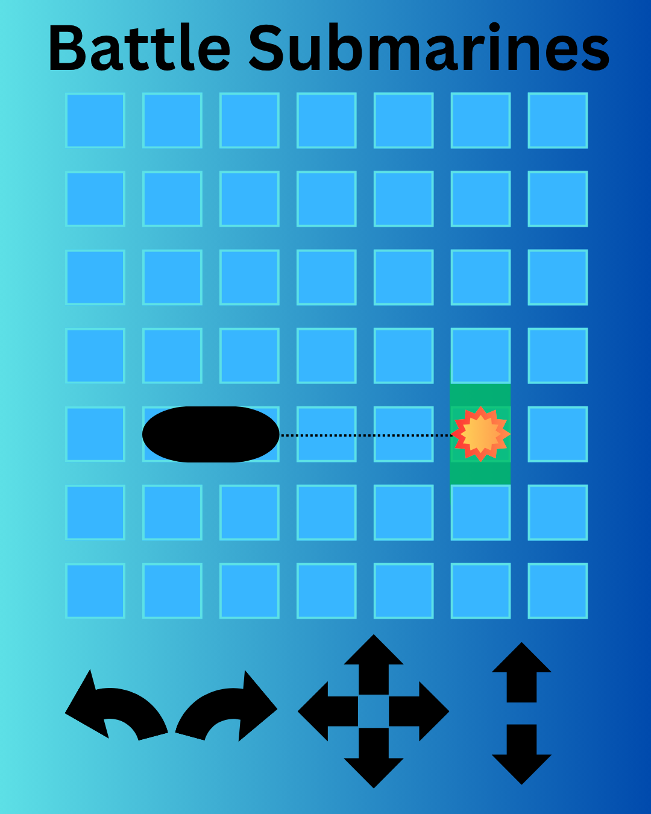
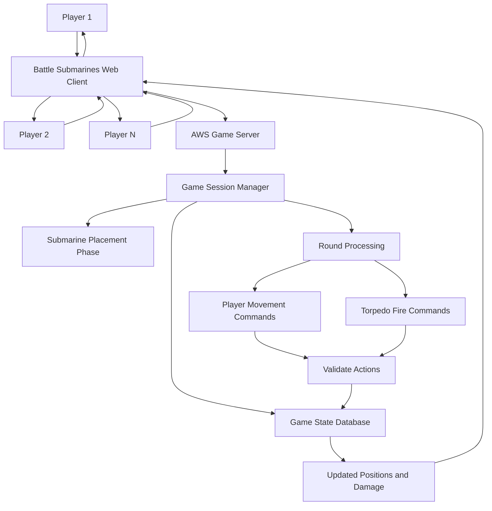

# Battle Submarines

This application is a transformation of the original battleship game, growing from 2D to 3D, as such they are submarines instead of regular ships and fire torpedoes instead of air missles. The application is built using html, css, javascript, react, mongoDB, websocket and amazon web services which allows it to host individual sessions with as many players as desired, each player recieving live updates about scores and positions as they control their submarine in round-based, synchronous combat interaction.

### Elevator pitch

We've all enjoyed the classic battleship game, whether digitized or in board-game form, but games have to evolve to stay relevant and maintain their success. That is where Battle Submarines comes in, a true advancement of what Battleship was meant to be, Battle Submarines turns 2D into 3D, slow, turn-based interaction into synchronous progression, and limited spatial decision-making into strategic movement. This application allows multiple sessions to be played at the same time with nearly unlimited players per session, meaning nearly unlimited fun.

### Design

Here is a sequence diagram detailing how users interact with the server to make their moves.

### Key features

- Secure login over https
- Ability to open and host multiple sessions
- Interface that displays and handles player interactions
- Web server that manages multiple rounds of each session
- Database that holds users and game history
- Real-time user updates between player decisions

### Technologies

I am going to use the required technologies in the following ways.

- **HTML** - Structures the webpages where users will log in, join/host game sessions and view the game layout
- **CSS** - Styling to detail the structure of each webpage as well as the gameplay elements 
- **React** - Handles the rendering/animations of webpage interactions and asset movement. Will also handle user interaction with webpage and playable characters
- **Service** - AWS manages the user login/logout, player actions as a whole, game session timing and scoring. Will also use NASA API to generate game maps from actual ocean photos
- **DB/Login** - Securely stores user information, score and session history
- **WebSocket** - Live updates the positioning and status of each player to each other as well as scores and hits.

## 🚀 Specification Deliverable

For this deliverable I did the following:

- [x] I completed the prerequisites for this deliverable (Git commit requirement)
- [x] Proper use of Markdown
- [x] A concise and compelling elevator pitch
- [x] Description of key features
- [x] Description of how you will use each technology
- [x] One or more rough sketches of your application.

## 🚀 AWS deliverable

For this deliverable I did the following. I checked the box `[x]` and added a description for things I completed.

- [x] **Rented EC2 server** - Succesfully acquired a working t3.nano server
- [x] **Leased domain name** - Purchased domain name battleship3.click
- [x] **Server accessible** from my domain: [https://battleship3.click](https://battleship3.click) - Ready for next steps

## 🚀 HTML deliverable

For this deliverable I did the following. I checked the box `[x]` and added a description for things I completed.

- [x] I completed the prerequisites for this deliverable (Simon deployed, GitHub link, Git commits)
- [x] **HTML pages** - 4 unique html pages made detailing the hypothetical process of website's usage.
- [x] **Proper HTML element usage** - Correct and logical use of varied html elements.
- [x] **Links** - Several working links to this github and each html page.
- [x] **Text** - Text used throughout to display real page details and future additions.
- [x] **3rd party API placeholder** - Included NASA API placeholder in play.html.
- [x] **Images** - Images included decoratively in index and menu.html.
- [x] **Login placeholder** - Login placeholder added to landing page.
- [x] **DB data placeholder** - Database placeholder included via leaderboard information.
- [x] **WebSocket placeholder** - WebSocket placeholder included via several live information aspects, server joining for example.

## 🚀 CSS deliverable

For this deliverable I did the following. I checked the box `[x]` and added a description for things I completed.

- [x] I completed the prerequisites for this deliverable (Simon deployed, GitHub link, Git commits)
- [x] **Visually appealing colors and layout. No overflowing elements.** - Site looks very colorful with a unique, consistent style. There are no overflowing elements.
- [x] **Use of a CSS framework** - Bootstrap was used, on most of the buttons for example.
- [x] **All visual elements styled using CSS** - All elements have some sort of styling using css.
- [x] **Responsive to window resizing using flexbox and/or grid display** - html pages adapt nicely to screen changes.
- [x] **Use of a imported font** - Orbitron used throughout the entire site now.
- [x] **Use of different types of selectors including element, class, ID, and pseudo selectors** - Basically every type of selector is used in its respective, relevant way.

## 🚀 React part 1: Routing deliverable

For this deliverable I did the following. I checked the box `[x]` and added a description for things I completed.

- [x] I completed the prerequisites for this deliverable (Simon deployed, GitHub link, Git commits)
- [x] **Bundled using Vite** - This code is fully runable with Vite.
- [x] **Components** - Webpage is now fully made up of React components.
- [x] **Router** - Different pages successfully accesible via router.

## 🚀 React part 2: Reactivity deliverable

For this deliverable I did the following. I checked the box `[x]` and added a description for things I completed.

- [x] I completed the prerequisites for this deliverable (Simon deployed, GitHub link, Git commits)
- [x] **All functionality implemented or mocked out** - Everything that looks like it should do something now does, most are placeholders.
- [x] **Hooks** - Hooks used througout in useStates and useEffects

## 🚀 Service deliverable

For this deliverable I did the following. I checked the box `[x]` and added a description for things I completed.

- [x] I completed the prerequisites for this deliverable (Simon deployed, GitHub link, Git commits)
- [x] **Node.js/Express HTTP service** - Web service now runs through express and node
- [x] **Static middleware for frontend** - Frontend uses middleware for authorization
- [x] **Calls to third party endpoints** - Service calls NOAA API to get real world weather conditions
- [x] **Backend service endpoints** - Backend has service endpoints, namely token authorization for retrieving usernames
- [x] **Frontend calls service endpoints** - Frontend calls backend when requesting restricted information
- [x] **Supports registration, login, logout, and restricted endpoint** - All aforementioned elements are handled on the backend with proper authorization
- [x] **Uses BCrypt to hash passwords** - Passwords completely go through BCrypt

## 🚀 DB deliverable

For this deliverable I did the following. I checked the box `[x]` and added a description for things I completed.

- [ ] I completed the prerequisites for this deliverable (Simon deployed, GitHub link, Git commits)
- [ ] **Stores data in MongoDB** - I did not complete this part of the deliverable.
- [ ] **Stores credentials in MongoDB** - I did not complete this part of the deliverable.

## 🚀 WebSocket deliverable

For this deliverable I did the following. I checked the box `[x]` and added a description for things I completed.

- [ ] I completed the prerequisites for this deliverable (Simon deployed, GitHub link, Git commits)
- [ ] **Backend listens for WebSocket connection** - I did not complete this part of the deliverable.
- [ ] **Frontend makes WebSocket connection** - I did not complete this part of the deliverable.
- [ ] **Data sent over WebSocket connection** - I did not complete this part of the deliverable.
- [ ] **WebSocket data displayed** - I did not complete this part of the deliverable.
- [ ] **Application is fully functional** - I did not complete this part of the deliverable.
